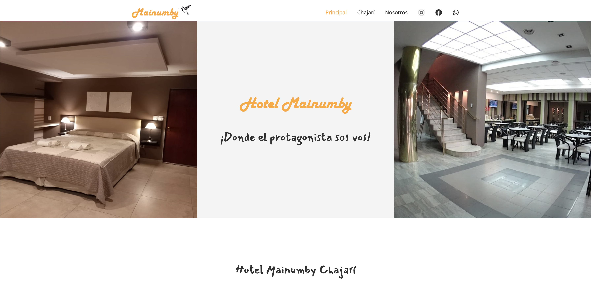

# Hotel Mainumby

This is a blog-style website based on Gatsby Starter Voyager. It's MIT licensed and ready to be used as-is or as a starting point from which to build something tailored to your needs. Use it, learn from it, build on it & enjoy.



# Features

- Beautiful starter blog with content in markdown
- Responsive, mobile-first design using tachyons.scss, flexbox, SCSS & CSS modules
- Fast, with top-notch lighthouse audit scores
- View posts by tag & author
- Pagination & next/prev navigation
- Social sharing links on blog posts (twitter, facebook, pinterest)
- SEO component with social sharing cards for twitter & facebook
- Structured data, schema.org
- Sitemap & RSS feed
- Support for email subscription to Mailchimp campaign
- Support for Google analytics

# Development

## Getting Started

```sh
git clone https://github.com/matiasracedo/hotelmainumby.git
cd hotelmainumby
npm install

# Standard Gatsby Development Commands

# Run development server
gatsby develop

# Build production distribution
gatsby build

# Locally serve production distribution
gatsby serve
```

## A Note About CSS & Design

I've designed the site using [Tachyons CSS](https://tachyons.io/), [SCSS](https://sass-lang.com/documentation/syntax) and [CSS Modules](https://www.gatsbyjs.org/docs/css-modules).

**Tachyons SCSS Library**
> Create fast loading, highly readable, and 100% responsive interfaces with as little css as possible.

Tachyons makes it easy to create responsive, mobile-first layouts. If you're looking at a CSS module and wondering if there's a method to my madness, well, there is.

For example:
```scss
// Many of my classes within a CSS Module will extend common classes as well as Tachyons classes.

.section-wrapper {
  // First, I'll extend any of my own common classes
  @extend .bg-primary;

  // Then, I'll extend the Tachyons classes, with each subsequent line extending classes for a larger viewport.
  @extend .center, .flex, .flex-column, .items-center, .mb5; // Effective on all screen sizes unless a more specific class (below) overrides it
  @extend .flex-row-l, .mb6-l; // Effective when viewport > ~960px wide
}
```

# Customizing Your Site

Here are the minimal steps you'll need to take to re-brand and re-configure the site as your own.

## Branding & Design

- Replace `/favicon.ico` with your own favicon
- Replace `/static/images/banner.png` with your own banner image - image needs to be 600x60px
- Replace `/static/images/logo.jpg` with your own logo image - image needs to be square
- Replace both index hero photos in `/src/pages/index.jsx` - images should be the same aspect ratio (square images work best)
- Replace other static images and text on index and about pages as well as the header & footer components
- Choose a new color scheme by setting new color variable values in `/src/styles/main.scss`:

```scss
    $color-primary: #e6eaf3;
    $color-secondary: #FEA82F;
    $color-tertiary: #FFC288;
    $color-tertiary-light: #FCECDD;
```
  - Note, the value for `$color-secondary` is hard-coded into the `gatsby-plugin-manifest` as the theme color, so it needs to change there along with other properties in the manifest.

## Configuration

**gatsby-config.js: siteMetadata**

| Property | Description |
|----------|-------------|
| siteUrl | the url for your site; used by the SEO component and for constructing links |
| author | the name of the site author; used in structured data |
| publisher | the name of the publisher; this can simply be the site's domain name (e.g. gatsby-starter-voyager.netlify.com); used in structured data |
| title | the default page title; used by the SEO component for title and meta tags, social sharing and structured data |
| description | the default page description; used by the SEO component for meta tags, social sharing and structured data |
| image | the default image used by the SEO component for meta tags, social sharing and structured data; image must be square |
| bannerImage | the default banner image used by the SEO component for structured data; image must be 600x60 px |
| blogPostsPerPage | the number of blog posts to show per paginated blog listing page (blog, author, tag listing pages, not used by the index page) |
| social.instagram | your instagram handle; will be added to the header & footer instagram link |
| social.twitter | your twitter handle; will be added to the header and footer twitter link |
| mailchimpUrl | your [mailchimp](https://mailchimp.com/) subscription link; it can be found in the mailchimp dashboard under `audience -> forms`; it will be a format like the following: `https://<MAILCHIMP-USERNAME>.us20.list-manage.com/subscribe/post?u=<MAILCHIMP-USER-ID>` |

**gatsby-config.js: plugins**

- Configure `gatsby-plugin-google-gtag` with your own `trackingId`, or comment.
- Rebrand your manifest in `gatsby-plugin-manifest` as mentioned above.

## Content

**Page Content**

Some page content (like the text in the about sections) have been externalized to markdown. The markdown files for partial page content exist in `content/copy/pages`. The  may vary from page to page, but some frontmatter fields are required. For example:
```yaml
---
type: page-content # required; should be "page-content"
name: about-2 # required; unique identifier for page content
heading: "Morbi"
image: "../../images/guille-pozzi-jD34AmVhESc-unsplash.jpg"
imageAlt: "alt text here"
---
```

**Blog Posts**

To add a blog post, create a new markdown file in `content/copy/blog-posts`. Here is an example of frontmatter with descriptions of each property:
```yaml
---
type: post # required; should be "post"
draft: false # flag to determine if this is a draft post and thus should not be displayed in production
title: Barcelona, Spain # title of the page; also used by SEO component
author: Maya # author; blog list pages are created for each author; also used by SEO component
date: 2019-08-25 # date; also used by SEO component
tags: # list of tags; blog list pages are created for each tag; each tag must also exist in tags.md data file
- travel
- europe
- spain
excerpt: Lorem ipsum dolor sit amet. # excerpt shown on list page; also used by SEO component
image: "../../images/biel-morro-d0xjEv-WJQk-unsplash.jpg" # featured image shown on list page; also used by SEO component
imageAlt: alt text here # alt text for the featured image
---

```

**Tags**

Tag metadata is stored in `content/data/tags.md`. If a new tag is added to a blog post, it should also be added to this data file. This file specifies which tags are featured and shown on the index page.

```yaml
---
type: data # required; should be "data"
name: tags # required; unique identifier for data
# Each tag_details entry contains:
#   name (name of the tag)
#   description (if present, shows on the tag page)
#   featured (if true, shows in the list of featured tags on the home page)
#   featured_image (the image to show on the home page)
#   featured_image_alt (alt text)
tag_details:
- name: europe
  description: 'All posts document our travels through Europe.'
  featured: true
  featured_image: "../images/termas-Chajari -aerea.jpeg"
  featured_image_alt: parque termal chajari aerea
```

# License

Licensed under the MIT License.

