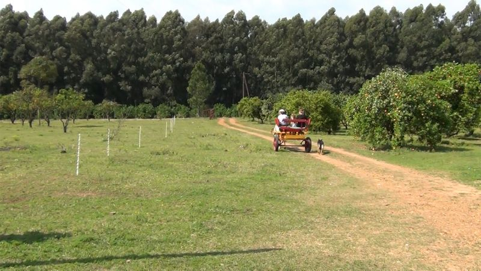

Tierra de azahares, cítricos y extensos predios forestados con eucaliptos, Chajarí seduce desde sus espacios rurales. Es allí donde se hace visible la riqueza productiva de esta porción de la provincia de Entre Ríos inmersa en un protegido edén natural.

Quintas ubicadas en una zona altamente privilegiada para el desarrollo citrícola, permiten a Chajarí hacer gala de su principal actividad económica. Y ello no es sólo ostentación, sino que el envío de frutas frescas a distintos mercados nacionales e internacionales, la elaboración de jugos concentrados con frutas seleccionadas para su procesamiento, y el uso de una moderna tecnología, convierten a la ciudad cada mes de noviembre, en escenario y protagonista de la “Fiesta Provincial de la Citricultura”, un acontecimiento que resume el trabajo, la idiosincrasia y el espíritu laborioso de su gente.

Circuitos guiados por plantaciones de distintas variedades de cítricos; alojamiento en magníficos entornos campestres musicalizados por el silencio y aromatizados por los azahares y eucaliptos; cabalgatas; paseos en tractor; caminatas dentro de quintas de nuez pecán; las propuestas de Chajarí se diversifican sorprendiendo al visitante.

Así, más allá de las jugosas naranjas y los recorridos por los cultivos, es también característica difundida de Chajarí la calidad de los salames artesanales y otros lácteos y embutidos. Deleite del gusto para lugareños y visitantes, nada más exquisito que una rica picada campestre acompañada con pan casero y armonizada con la cordialidad de la gente.

## Finca El Pez

Recepción con picada de salames y quesos de la zona, tenedor libre de asado y ensaladas. Paseos en sulky y a caballo por la plantación de cítricos desde donde podrán sacar frutos para consumir en el lugar. Show musical y baile. Contratar con anticipación en el hotel, consulte precio.