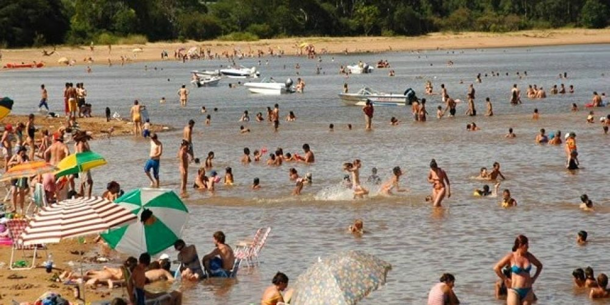
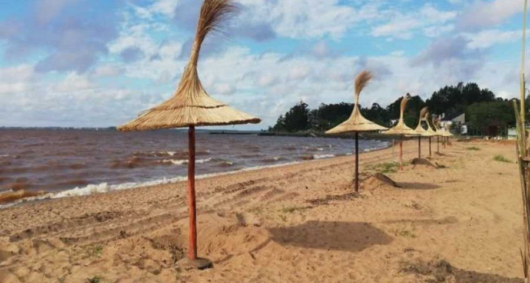

Internándose por sólidos caminos de ripio, entre espesas plantaciones de cítricos y eucaliptos, tras el recorrido de unos kilómetros, Chajarí se brinda al turismo veraniego con toda la belleza del Lago Salto Grande, el verde de la naturaleza, las playas de arena que lo contemplan desde la orilla, el cielo limpio y el sol brillante.
Un lugar destinado para quienes buscan la distensión placentera, las aguas frescas, el aire libre y la satisfacción de compartir en familia.

## Balneario Camping Chajarí

Sobre el Lago Salto Grande, a una corta distancia de la ciudad, se expanden 17 frondosas hectáreas en las que el turista encuentra la satisfacción estival.
El balneario de Chajarí seduce desde su posicionamiento en el entramado de ripio de las profundidades, desplegando bellas playas de arena y piedra a orillas del lago, en torno a un espacio de naturaleza desbordante y silencio abrazador.
Deportes náuticos, recreación, placeres, sosiego, el verano en Chajarí se vive inmerso en ambientes naturales y servido con las justas comodidades.
Muelle de pesca; áreas deportivas; juegos infantiles; zona de carpas; complejo de bungalows de 1, 2, 3 y 4 categoría; proveeduría; sanitarios; conforman la infraestructura de este lugar de veraneo donde además es posible deleitarse con una buena película y participar de eventos y actividades organizados por la Subdirección de Cultura, Turismo y Deporte.
A 16Km. del área urbana de Chajarí, por Av. 26 de Mayo al final.

## Playas privadas Piedras Finas

Cinco playas privadas bordean el Lago Salto Grande en territorio del Establecimiento Piedras Finas, un espacio donde el agua corre y por ello se muestra más limpia y seductora.
Esta área natural está caracterizada asimismo por la presencia de canteras de piedras que anteceden a la costa lacustre diseñando un sitio diferente y especial para el disfrute de los visitantes.
Zona de acampe, alojamiento en cabañas, permiten el placer de descubrir este rincón entrerriano, situado en un ambiente rural, entre Chajarí y Santa Ana.

## Playas de Santa Ana

Extensiones de arena limpia a metros de la línea de veredas; espigón apretado por rocas en un entorno cautivante; conjunción de sol pleno y despliegue de sombra de eucaliptos e Ibirá Pitá; todo ello define las exquisitas playas de Santa Ana, recostadas sobre el Lago Salto Grande.
Entre caminos de ripio que se entrelazan, allí aparece el Camping Santa Ana, una de las más espléndidas playas entrerrianas, perfilada por arenas amarillas y aguas traslúcidas.
Proveeduría, restaurante, sanitarios, área de camping, bungalows y cabañas internos al predio, hacen a la infraestructura turística de este rincón maravilloso donde la distensión se ofrece como una vivencia sin obstáculos.
En proximidades de la zona urbanizada. A 17Km. de Chajarí.

## Balneario Drewanz

Belleza envolvente, aguas limpias en las que refrescarse, y superficies acogedoras sobre las cuales tenderse al sol, este pedacito de Colonia Ensanche Sauce conserva su espacio privilegiado en la propuesta turística chajariense.
Pintado por azules y verdes, y propicio para la práctica de todas las disciplinas náuticas, el balneario constituye un espacio de combinación perfecta entre la serenidad buscada y la diversión merecida.
Cuenta con todos los servicios necesarios para el disfrute sin preocupaciones.
A menos de 20Km. de Chajarí.