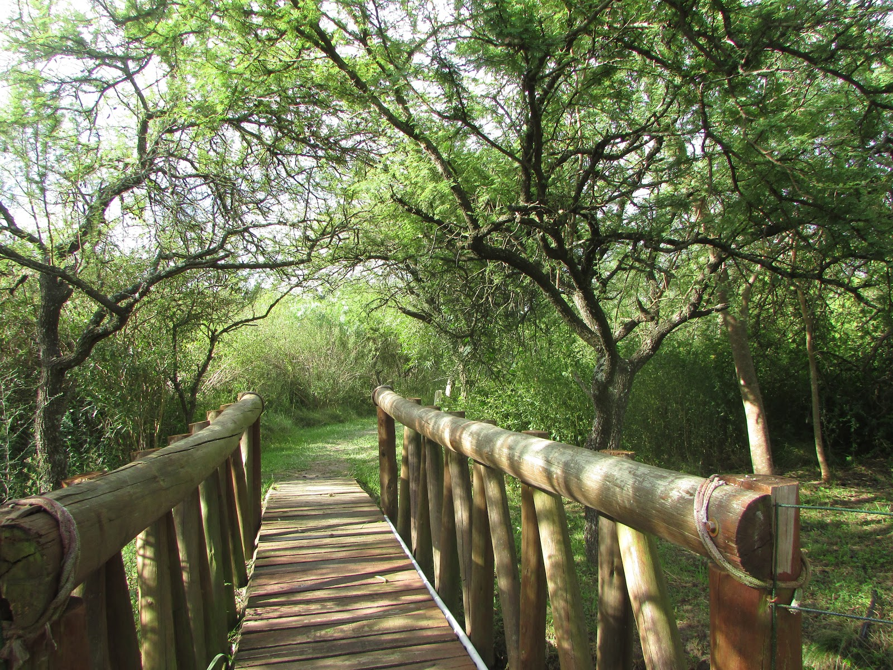
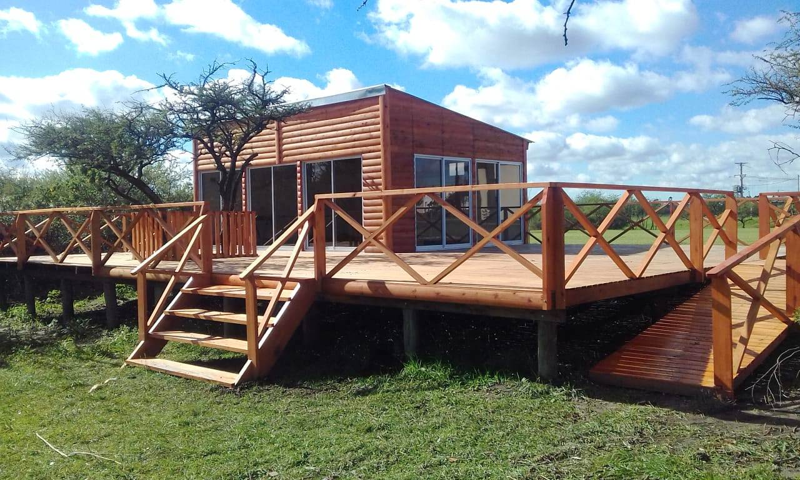

## Ubicación

El Parque Termal “Daniel Tisocco” se encuentra ubicado al norte de la provincia de Entre Ríos. Cuenta con una superficie de 40 ha emplazadas sobre el kilómetro 329 de la Autovía Nacional “José Gervasio Artigas” y la Avenida “Padre Miguel Gallay”.

El Parque cuenta con 11 piscinas, señalizadas y segmentadas para niños y adultos con temperaturas de agua termal que varían desde los 32º a los 40º. Entre ellas se encuentra una piscina integrada, adaptada para personas con movilidad reducida; una piscina con cascada para la relajación muscular; tres piscinas con hidrojets; una semi-olímpica para actividades recreativas; una mini piscina babero; dos piscinas para niños con juegos recreativos y, por último, una piscina de uso temporal con toboganes. Se suman, además, los sectores de duchas y jacuzzis, mas 3 piscinas de agua fría para disfrutar durante el verano.

## Reserva Natural

Se ubica en el noroeste del Parque Termal y cuenta con dos senderos que se encuentran diagramados de acuerdo a la potencialidad natural del lugar. Allí además se emplaza en Centro de Interpretación de la Naturaleza, un lugar para aprender más sobre la flora y fauna de nuestra región y avistar aves.

Sendero «A»: recorriendo sus caminos se pueden encontrar especies vegetales y animales características de la eco-región de la provincia de Entre Ríos denominada “El Espinal”; además, en su recorrido, se pueden avistar aves utilizando el mirador allí emplazado. El sendero es de corto trayecto y su recorrida se puede realizar en aproximadamente 30 minutos, demandando poco esfuerzo físico.

Sendero «B»: en este circuito se pueden observar especies vegetales y animales nativas de la zona ribereña del río Uruguay en el que se detectan «Tres mojones» de selva en galería; además, en su recorrido, se pueden avistar aves utilizando el mirador allí emplazado. El sendero es de corto trayecto y su recorrida se puede realizar en aproximadamente 60 minutos, demandando mayores esfuerzos físicos debido a la calidad del suelo que, por sectores, se torna arcilloso y con leves pendientes.

## Centro de Interpretación de la Naturaleza

Se encuentra ubicado dentro del Parque Termal en el sector de la Reserva Natural. Dentro de sus instalaciones se pueden disfrutar de proyecciones audiovisuales, caminatas guiadas y charlas sobre la flora y fauna de nuestra región a cargo de profesionales idóneos. 

## Juegos de la Reserva Natural

Se encuentran dentro del Parque Termal y están confeccionados con maderas rústicas. Los mangrullos y juegos de destreza forman parte de las propuestas naturales que se brindan dentro de este sector e incluye, entre sus atractivos, un mirador para avistar aves.

## Espejo de agua

Se encuentra ubicado dentro del Parque Termal y cuenta con diversas especies acuáticas características del río Uruguay como pacúes, sábalos, peces amur, rhandia o bagre lagunero. Este espacio, además, se emplaza una pasarela y mobiliarios para el disfrute de los visitantes.